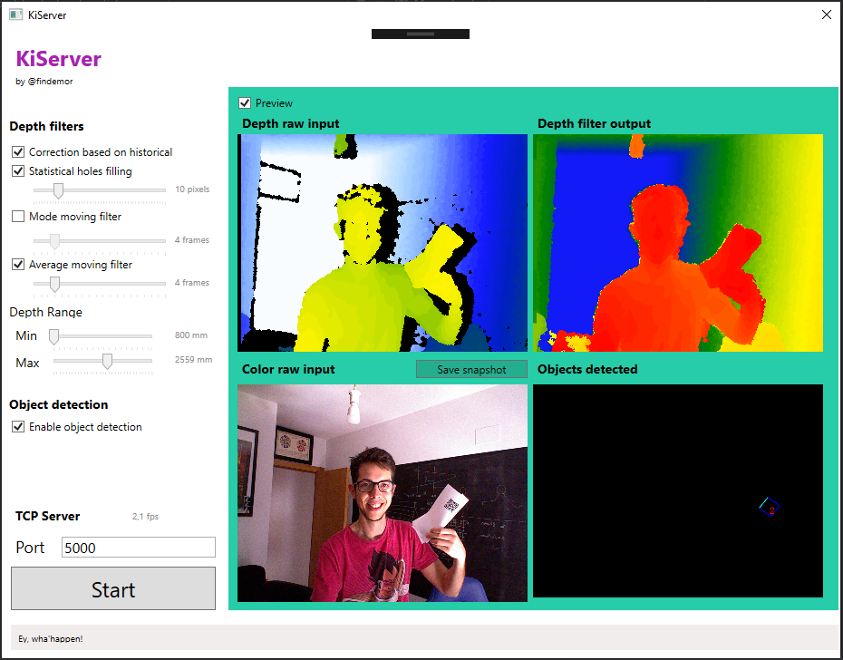

# KiServer

Servidor TCP que envía diversa información capturada con la cámara Kinect v1 de XBOX360, posteriormente a la aplicación de un filtrado de limpieza de la información parametrizable.



## Resumen del funcionamiento

### Imagen infrarroja, profundidad

La aplicación obtiene información de profundidad de la camara de infrarrojos de Kinect v1 (versión xbox 360) y de la cámara de color.

Como puede verse en la captura, la imagen original capturada por la camara de infrarrojos contiene una serie de sombras y "huecos negros" debido a la forma en que está construida la Kinect (sobre todo con objetos cercanos), a los materiales en donde la luz infrarroja está rebotando, etc.

El programa permite aplicar una serie de algoritmos para resolver algunos de estos problemas. Se describirán más adelante. El restultao de estos algoritmos será un array de 320x240 puntos donde cada uno es la distancia en milimetros hasta el objeto. Objetos fuera del rango especificado se ignoran, por lo que hay que sumar la minima distancia a cada punto si se quiere concer la distancia real.

### Imagen a color, objetos

La imagen a color se emplea para identificar objetos (en particular códigos QR). Se obtienen las esquinas y el punto central del objeto, así como la información que contiene.

Los códigos detectados se pueden ver en la captura, en la preview "Objects detected".

## Filtros disponibles y parametrización

Estos son los filtros disponibles y su propósito principal.

### Correction based on historical

Este filtro intenta sustituir cada punto sin información (puntoss negros) por el último punto que tuvo información válida en esas coordenadas.

Este filtro reduce el temaño de los huecos negros, es adecuado cuando hay puntos negros pequeños que "parpadean" en una zona, principalmente para arreglar problemas por la refracción de la luz infrarroja en ciertos materiales.

### Statistical holes filling

El filtro busca alrededor de cada punto negro, en busquedas incrementales de mayor radio cada vez hasta alcanzar el máximo determindo en el slider. Despues calcula el valor moda de valores medios de profundidades en la matriz alrededor del punto, y lo asigna al punto negro. 

Esta corrección es la mas precisa, pero en huecos muy grandes no resulta eficiente, por lo que cuando no se ha encontrado ningun valor válido en dentro de la matriz de búsqueda más grande posible, se hace una búsqueda rápida horizontal y vertical, y se sustituye el punto negro por el primer valor válido más cercano. Esto implica que a veces la corrección genere parches sin sentido en la imagen, pero este filtro se diseñó con el propósito de que no existiese ningún hueco sin información en la imagen.

Si se desea cubrir completamente la imagen con información válida, o se tienen huecos muy pequeños sin información, esta es la corrección más adecuada.

### Mode moving filter

Este filtro retiene en memoria los últimos N frames capturados (los indicados por su slider) y calcula la moda de cada punto en esos frames. La imagen resultante es la moda de las ultimas capturas.

Como puede apreciarse en la imagen original, los bordes de los objetos parecen "vibrar" porque la luz reflejada no siempre es devuelta del mismo modo. De hecho, en general, todos los valores de la imagen oscilan entre cierto rango de valores.

Calcular la moda genera cierto retraso en la imagen resultante (en función del numero de frames calculados) pero reduce este efecto, y especialmente en el borde de los objetos mantiene las líneas nítidas pero sin tanta vibración.

Este filtro no es especialmente eficiente (solo se empleó para realizar ciertas pruebas), en ese sentido el filtro average moving filter es mejor.

### Average moving filter

Este filtro es parecido al anterior, pero más eficiente.

El objetivo es el mismo, reducir la vibración de la imagen (la variabilidad de valores de los puntos en objetos inmoviles) especialmente en los bordes de los objetos.

Al hacer la media de cada punto en los últimos N frames, los bordes no quedan tan "limpios" como con el filtro anterior, sino que se produce cierto degradado en la profundidad, por lo que no es adecuado para objetos con los bordes muy definidos, pero sí para pendientes, por ejemplo.

### Depth Range

Sólo se capturarán objetos dentro del rango especificado. Objetos más cercanos o lejanos serán ignorados en la imagen de profundidad.

A la información de profundidad se le esta aplicando el offset de este rango, por ejemplo un objeto que dice estar a 400mm, en realida estaría a 1200mm si el rango minimo es de 800mm. 800 + 400 = 1200mm.

### Object Detection

No se trata realmente de un filtro, sino que activa el procesamiento de imagenes a color para intentar detectar objetos en la imagen y representarlos en el preview. Esto reduce notablemente el framerate.

## Instrucciones de instalación

Es necesario instalar en primer lugar el SDK de Kinect v1 for xbox360. 
Despues, enchufar la kinect al pc.

Los SDKs utilizadoss en el proceso de desarrollo están disponibles en la carpeta [doc/sdks](doc/sdks).

Se siguieron estas instrucciones

* Instalar Kinect XBox 360 (v1) en Windows 10

[https://blogs.msdn.microsoft.com/esmsdn/2011/06/16/descarga-del-sdk-de-kinect-para-windows-disponible/](https://blogs.msdn.microsoft.com/esmsdn/2011/06/16/descarga-del-sdk-de-kinect-para-windows-disponible/)

[https://social.msdn.microsoft.com/Forums/en-US/73ef4c8c-fc4b-4321-9d6b-6c147bca6ba5/360-kinect-worked-with-windows-7-but-not-with-windows-10?forum=kinectv2sdk](https://social.msdn.microsoft.com/Forums/en-US/73ef4c8c-fc4b-4321-9d6b-6c147bca6ba5/360-kinect-worked-with-windows-7-but-not-with-windows-10?forum=kinectv2sdk)

* Installing KinectSDK-v1.8-Setup.exe & KinectDeveloperToolkit-v1.8.0-Setup.exe with Kompatibility Settings Windows 7
* Then in Visual Studio 2017 I recompiled all of the samples provided by KinectDeveloperToolkit (C#, C++)

* Enlaces: 
	* https://download.microsoft.com/download/E/1/D/E1DEC243-0389-4A23-87BF-F47DE869FC1A/KinectSDK-v1.8-Setup.exe
	* https://download.microsoft.com/download/D/0/6/D061A21C-3AF3-4571-8560-4010E96F0BC8/KinectDeveloperToolkit-v1.8.0-Setup.exe


## Formato y protocolo de comunicación

### Protoclo

Si se pulsa START, se iniciará el servidor TCP, y se detendrá el procesamiento de nuevos frames hasta que se conecte un cliente TCP.

El cliente TCP recibe un paquete de datos cada vez que se ha procesado nueva información. El paquete de datos tiene este formato:

```csharp
public class TCPData
    {
        public long Timestamp;
        public Dictionary<string, string> Metadata;
    }
```

Cada vez que el servidor ha enviado un paquete, no procesará más datos hasta no recibir respuesta por parte del cliente. La respuesta del cliente será unicamente el valor Timestamp del paquete que acaba de procesar.

### Formato

El paquete de datos contiene el timestamp del dato, en milliseconds.
Además, contiene un diccionario de información, donde podrían aparecer las siguiente claves (no siempre aparecen todas).

* DepthArray: Cada pixel de la imagen de profundidad (320x240) contiene el valor en milimetros de profundidad al objeto, como se ha descrito antes. Este campo contiene esta información del siguiente modo.
	* La imagen se reducido a un array unidimensional.
	* Cada posición del array es un pixel (tipo short) pero en formato char.
	* La cadena de formato char se pasa a UTF8 y se codifica en Base64 para poder enviarlo sin problemas por cualquier canal de datos.
* DepthWidth: numero de pixeles de ancho de la matriz de profundidad, para volver a formar la imagen a partir del DepthArray.
* DepthHeight: número de pixeles de alto de la matriz de profundidad, para volver a formar la imagen a partir del DepthArray.
* MinDepth: valor minimo establecido en el rango de profundidad del filtro. Si se quiere conocer la profundidad de un objeto respecto a la camara, debe sumarse a cada valor de DepthArray.
* MaxDepth: valor máximo de profundidad establecido en el rango de profundidad del filtro. Objetos más lejanos no se recogen.
* ObjXXXX: Siendo XXXX el valor de un código QR unico en la imagen. Si se ha detectado el objeto que contiene "A", por ejemplo, se enviaria una clave ObjA. Que contendría la posición del centro del objeto, conforme a lo siguiente.
	* Las coordenadas se envian separadas por coma: X,Y
	* Cada oordenada es un valor de 0 a 100, representando un porcentaje de la imagen. De este modo, es compatible con cualquier tamaño de imagen de destino.

### Processor e implementación de otros formatos


## Instrucciones de desarrollo v1.8

[https://digitalerr0r.wordpress.com/2011/06/20/kinect-fundamentals-1-installation-setup/](https://digitalerr0r.wordpress.com/2011/06/20/kinect-fundamentals-1-installation-setup/)

### TCP

#### Unity
[https://gist.github.com/danielbierwirth/0636650b005834204cb19ef5ae6ccedb](https://gist.github.com/danielbierwirth/0636650b005834204cb19ef5ae6ccedb)

#### .NET
[http://www.codingvision.net/networking/c-simple-tcp-server](http://www.codingvision.net/networking/c-simple-tcp-server)
